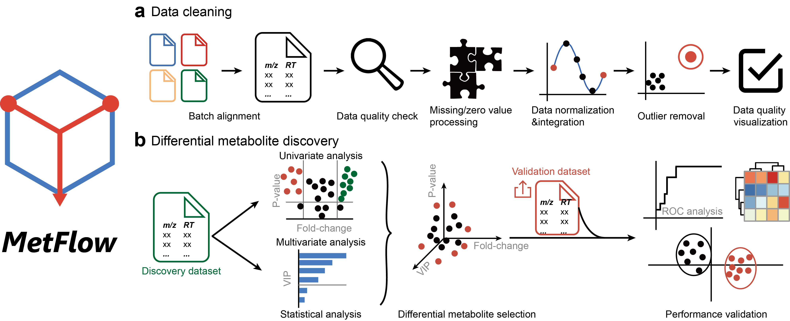

---
output:
  html_document: default
  pdf_document: default
  word_document: default
---

### Pregnancy Project at Stanford University
---

<h5 align="justify" style="font-weight: normal; line-height:40px;")>
Mass spectrometry-based metabolomics aims to profile the metabolic changes in biological systems and identify differential metabolites in relation to physiological phenotypes and aberrant activities. However, many confounding factors during data acquisition complicate metabolomics data, which is characterized by high dimensionality, uncertain degrees of missing and zero values, non-linearity, unwanted variations, and non-normality. Therefore, prior to differential metabolite discovery analysis, various types of data cleaning such as batch alignment, missing value imputation, data normalization and scaling are essentially required for data post-processing. Here, we developed an interactive web server, namely, MetFlow, to provide an integrated and comprehensive workflow for metabolomics data cleaning and differential metabolite discovery.
</h5>

