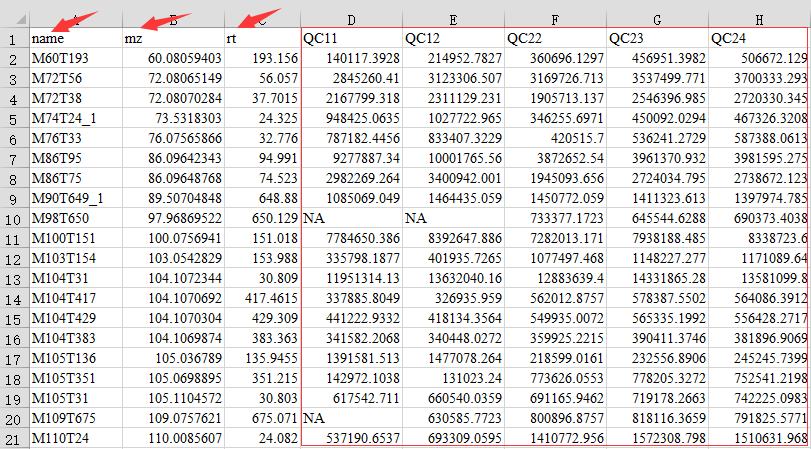
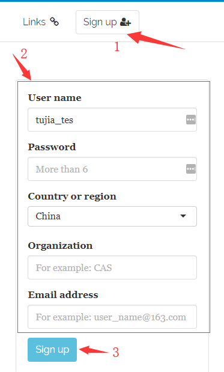
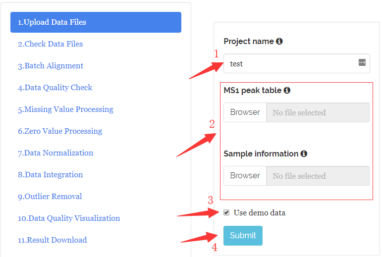
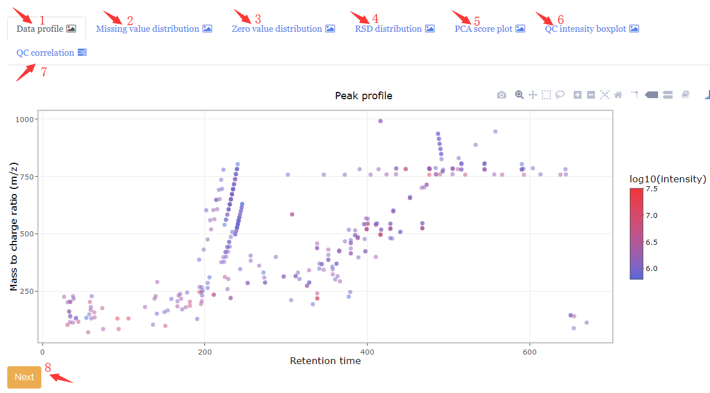
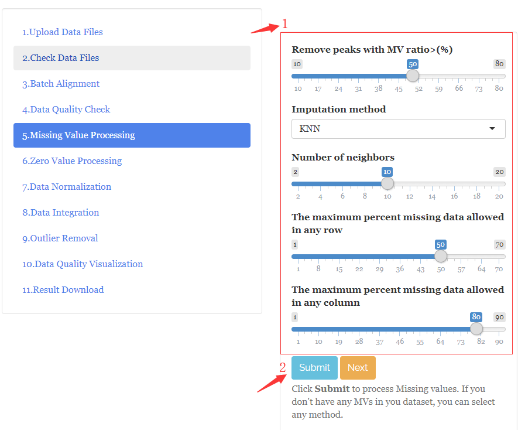
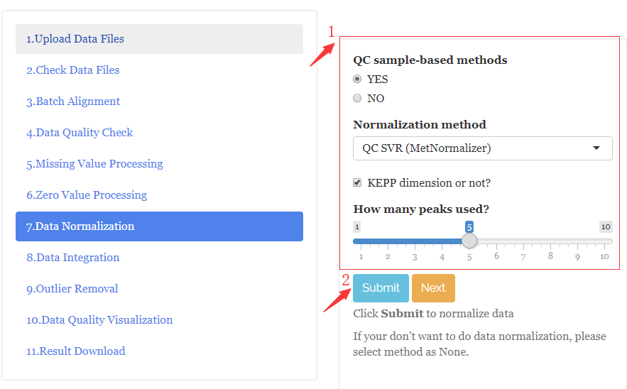
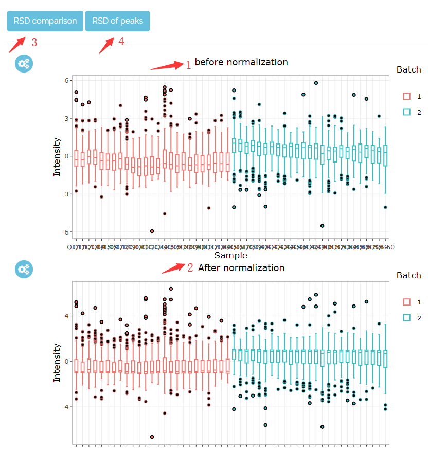
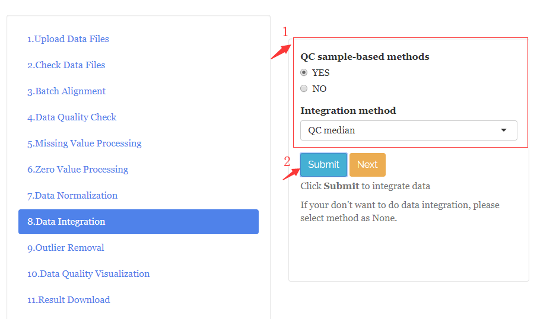
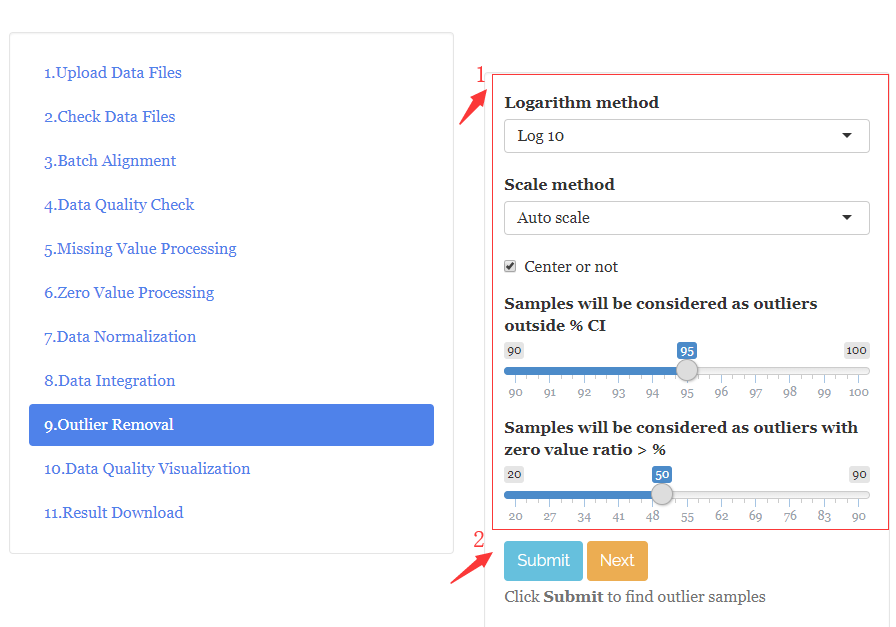

<!--  -->

<!-- --- -->

# Data Preparation

MetFlow requires the import of the following files, including:

* One or multiple MS1 peak tables (.csv format), 

* A table for sample information (.csv format). 

## Prepare MS1 peak tables

The MS1 peak table is a list of metabolic peaks with annotated m/z, retention times (RTs) and peak abundances. 

### Untargeted metabolomics data

LC-MS or GC-MS untargeted metabolomics data can be generated using processing sortware, such as XCMS or MS-DIAL. The peak table from software must be modified for `MetFlow`. 

* The format of MS1 peak table must be csv;
* The first column is the peak name ("name");
* The second column is the mass-to-charge ratio ("mz");
* The third column is the retention time ("rt");
* The unit of retention time must be second (not minute);
* Other columns are peak abundances of MS1 peaks in each sample.

**IMPORTANT:** the order and names of the first three columns must be "name", "mz", and "rt".

**Note:** If you use `fillPeaks` function in XCMS to process data, there will be no missing values (MV) in the MS1 peak table.


The final generated MS1 peak table should look like:

<!--  -->


### Targeted metabolomics data

For targeted metabolomics data, such as MRM, because there is no accurate m/z, so users must assign pseudo m/z values for each peak.

## Prepare a sample information file

The sample information file (.csv format) is designed to describe the sample injection order, class, batch and group information. The first column is named as "sample.name", while the second column is named as "injection.order", the third column is "class", the fouth column is "batch" and the fifth column is "group". "class" is used to descibe the class of samples: subject sample ("Subject") or QC sample ("QC"). The "group" is used to describe the group information of samples, and QC samples should be names as "QC". The sample information file should look like:

<!--  -->


**NOTE:** The "sample.name" column in sample information file must be the **EXACTLY** same as the sample names in the MS1 peak table.


## Important notes for data preparation

* In the MS1 peak table, make sure that no "-" or blank appears in the peak name or sample name. If there are some symbols that cannot be recognized by our program, the data processing may be failed.
* The "sample.name" column in sample information file must be the **EXACTLY** same as the sample names in the MS1 peak table.
* Please make sure that sample information (.csv format) and MS1 peak table (.csv format) are separated by comma. Because in some countries or regions (European and some French-speaking regions), the default separator is semicolon. You can open the sample information or MS1 peak table with notepad or other text editors to check whether they are separated by comma.

<!-- --- -->

# Log In or Sign Up

## Sign up

If you are using `MetFlow` for the first time, please sign up first.

1. Click "Sign up" tab;
2. Enter your information;
3. Click "Sign up" button.

<!--  -->


## Log in

1. Click "Log in & Account" tab;
2. Enter your user name and password;
3. Click "Log in" button.

<!--  -->


<!-- --- -->

# Data Cleaning

Data cleaning is implemented as a step-wised and standardized workflow under "Data Cleaning" tab. Users should process data step by step.

## Upload Data Files

1. Enter the project name;
2. Select the MS1 peak tables (.csv format) and Sample information (.csv format);
3. Or you can use demo data;
4. Click "Submit" button to upload data.

<!--  -->


## Check Data Files

Then `MetFlow` check the data format of MS1 peak tablss and sample information. If there are error in you data, please click `Previous` to check your data and upload again. If there is no error, you can click `Next` for the next step.


## Batch Alignment

### Parameter setting

1. Set parameters for rough alignment;
2. Click `Submit` for batch alignment.

```{r setup, include=FALSE}
library(kableExtra)
library(magrittr)
knitr::opts_chunk$set(echo = TRUE)
```

```{r, echo=FALSE}
knitr::kable(
  data.frame("Paramter" = c("m/z tolerance (ppm)",
                            "Retention time tolerance (second)"),
  "Meaning" = c("m/z tolerance (ppm) for rough alignment.",
                "Retention time tolerance (ppm) for rough alignment."),
  stringsAsFactors = FALSE
  ),
  caption = 'Parameters of batch alignment',
   format = "latex", booktabs = TRUE) %>%
    kableExtra::kable_styling(full_width = TRUE
                # latex_options = "scale_down",
                # font_size = 20
                )
```

<!--  -->


### Result

1. The "Parameter optimization" tab shows the m/z error, RT error and log10intensity error deviation in rough alignment. 
2. The "MS1 peak table after batch alignment" tab shows the aligned MS1 peak table, users can click "Download" to download it. 
3. Then click "Next" for the next step.

<!--  -->


## Data Quality Check

Then the data quality is visually checked using 7 different creteria:

1. Data profile: m/z vs RT vs log10(intensity);
2. Missing value distribution: Missing value ratios in peaks and samples;
3. Zero value distribution: Zero value ratios in peaks and samples;
4. RSD distribution: RSD distribution in QC samples, you can also use different group to calculate RSD;
5. PCA score plot: PCA score plot of different batches;
6. QC intensity boxplot: QC auto-scaled intensity boxplot in different batches;
7. QC correlation: The correlations of QC samples;
8. All the figures can be downloaded. Then click "Next" for the next step.

<!--  -->


## Missing Value Processing

### Parameter setting

1. Set parameters for missing value processing;
2. Click `Submit`.

```{r, echo=FALSE}
knitr::kable(
  data.frame("Paramter" = c("Remove peaks with MV ratio > (%)", 
                            "Imputation method"),
  "Meaning" = c("It means that if the MV ratio larger than \nthe threshold you set, the peaks will                  be removed from the dataset. For example, the default of this parameter is 50,                    it means that for each peak, if its MV ratio > 50%, this peak will be removed.",
              "`MetFlow` has 9 methods for missing value imputation: 1) Zero value, 2) Mean,                     3) Median, 4) Minumun, 5) KNN, 6) missForest and 7) BPCA. The default is KNN."),
  stringsAsFactors = FALSE
  ),
  caption = 'Parameters of missing value processing',
  format = "latex", booktabs = TRUE) %>%
  kableExtra::kable_styling(full_width = TRUE
                # latex_options = "scale_down",
                # font_size = 20
                )
```


<!--  -->


### Results

1. Summary: Show the peaks which are removed from the dataset;
2. MS1 peak table (after MV processing): You can download the MS1 peak table after MV processing;
3. Click `Next`.


<!--  -->


## Zero Value Processing

1. Set parameters for zero value processing;
2. Click `Submit`.
3. Summary: Show the peaks which are removed from the dataset;
4. MS1 peak table (after zero processing): You can download the MS1 peak table after zero processing;
5. Click `Next`.


```{r, echo=FALSE}
knitr::kable(
  data.frame("Paramter" = c("Remove peaks with zero ratio > (%)"),
  "Meaning" = c("It means that if the zero ratio larger than the threshold you set, the peaks will be removed from the dataset. For example, the default of this parameter is 50, it means that for each peak, if its zero ratio > 50%, this peak will be removed."),
  stringsAsFactors = FALSE
  ),
  caption = 'Parameters of zero value processing',
   format = "latex", booktabs = TRUE)%>%
    kableExtra::kable_styling(full_width = TRUE
                # latex_options = "scale_down",
                # font_size = 20
                )
```

**NOTE:** If there are no missing values in your data, you can select any imputation method.

<!--  -->


## Data Normalization

### Parameter setting

1. Set parameters for data normalization;
2. Click `Submit`.

```{r, echo=FALSE}
knitr::kable(
  data.frame("Paramter" = c("QC sample-based methods", "Normalization method"),
  "Meaning" = c("You can check the methods based QC sample or not.",
                "There are 3 common used non-QC sample-based methods: 'Mean', 'Median' and 'Total'. And there are two common used QC sample-based methods: 'QC SVR (MetNormalizer)' and 'QC LOESS'. "),
  stringsAsFactors = FALSE
  ),
  caption = 'Parameters of data normalization',
   format = "latex", booktabs = TRUE)%>%
    kableExtra::kable_styling(full_width = TRUE
                # latex_options = "scale_down",
                # font_size = 20
                )
```


<!--  -->


### Results

#### Summary

1. QC intensity box plot before normalization;
2. QC intensity box plot after normalization;
3. RSD comparison;
4. The distribution of RSDs of peaks.

<!--  -->


#### MS1 peak table (after data normalization)

1. For each peak, you can select it, then click "Before normalization" or "After normalization" to show it's intensity drift.
2. Click `Next`.

## Data Integration

### Parameter setting

1. Set parameters for data integration;
2. Click `Submit`.

```{r, echo=FALSE}
knitr::kable(
  data.frame("Paramter" = c("QC sample-based methods", "Integration method"),
  "Meaning" = c("You can check the methods based QC sample or not.",
                "There are 2 common used non-QC sample-based methods: 'Subject mean' and 'Subject median'. And there are two common used QC sample-based methods: 'QC mean' and 'QC median'."),
  stringsAsFactors = FALSE
  ),
  caption = 'Parameters of data integration',
   format = "latex", booktabs = TRUE)%>%
    kableExtra::kable_styling(full_width = TRUE
                # latex_options = "scale_down",
                # font_size = 20
                )
```

 
<!--  -->


Like data normalization, you can also see the single peak intensity plot, QC auto-intensity boxplot, RSD comparison plot and RSD of peaks. Then click "next" for next step.


## Outlier Removal

### Parameter setting

```{r, echo=FALSE}
knitr::kable(
  data.frame("Paramter" = c("Logarithm method", "Scale method", 
                            "Samples will be considered as outliers outside % CI",
                            "Samples will be considered as outliers with zero value ratio > %"),
  "Meaning" = c("default is 'Log 10'.", "default is 'Auto scale'.",
                "It means that if one sample is outside % confidence interval, the sample will be considered as outlier samples. The default is 95%.",
                "It means that it one sample with zero value ratio bigger than %, the sample will be considered as outliers. The default is 50%."),
  stringsAsFactors = FALSE
  ),
  caption = 'Parameters of outlier removal',
    format = "latex", booktabs = TRUE)%>%
    kableExtra::kable_styling(full_width = TRUE
                # latex_options = "scale_down",
                # font_size = 20
                )
```

<!--  -->


### Delete outlier samples

1. The information outlier samples;
2. Select outlier samples which you want to remove;
3. Click `Delete`;
4. Click `Submit` again.

<!--  -->


## Data Quality Visualization

`MetFlow` also visually assesses the data quality after data cleaning.

## Result Download

1. Click "Generate HTML Summary" to generate analysis report (html format);
2. Then click "Download HTML Summary" to download the analysis report;
3. Click "Generate Analysis Result" to generate analysis result (zip foramt);
4. Then click "Download Analysis Result" to download the analysis result.

<!--  -->


# Differential Metabolite Discovery

Differential metabolite discovery analysis is implemented as a step-wised and standardized workflow under "Differential Metabolite Discovery" tab. Users should process data step by step.

## Upload Data Files

This step is same as "Data Cleanning".

## Check Data Files

This step is same as "Data Cleanning".

## Univariate Analysis

### Parameter setting

1. Set parameters for univariate analysis;
2. Click `Submit`.

```{r, echo=FALSE}
knitr::kable(
  data.frame("Paramter" = c("Control group", "Case group", "Logarithm method",
                            "Use what to calculate fold change",
                            "Hypothesis testing method",
                            "Alternative", "Paired t-test", "Correction method",
                            "P-value cutoff", "Fold change cutoff"),
  "Meaning" = c("Select the control group.", "Select the case group.",
                "Select logarith method, default is 'No log'.", 
                "Use mean or median value of samples in one group to calcualte fold-change, default is 'Mean'.",
                "'Student's t test' or 'Wilcoxon test'.", "'Two sided', 'Less' or 'Greater'.",
                "Paired or not.", "Select Correction method, default is 'False discovery ratio (FDR)'.",
                "Default is 0.05.",
                "Default is 2, it means fold change (case/control) > 2 or < 0.5."),
  stringsAsFactors = FALSE
  ),
  caption = 'Parameters of univariate Analysis',
    format = "latex", booktabs = TRUE)%>%
    kableExtra::kable_styling(full_width = TRUE
                # latex_options = "scale_down",
                # font_size = 20
                )
```


<!--  -->


### Results

1. Volcano plot: The volcanplot is utilized to visualized the differential metabolites.;

2. Fold change and P-value: Fold-changes and P-values for all peaks.


## Multivariate Analysis

### Set parameters

1. Set parameters for multivaraite analysis;
2. Click "Submit".

```{r, echo=FALSE}
knitr::kable(
  data.frame("Paramter" = c("Logarithm method", "Scale method", 
                            "Center or not"),
  "Meaning" = c("Select logarith method, default is 'Log 10'.",
                "Select scale method, default is 'Auto scale'.",
                "Default is checked."),
  stringsAsFactors = FALSE
  ),
  caption = 'Parameters of multivariate analysis',
   format = "latex", booktabs = TRUE)%>%
    kableExtra::kable_styling(full_width = TRUE
                # latex_options = "scale_down",
                # font_size = 20
                )
```

<!--  -->


### Results

#### PCA analysis

The PCA score plot.

#### PLS analysis

1. Click "Q2cum" and select the ncomp with the biggest Q2cum, and then click "Submit";
2. Click "Q2cum&R2cum" to see the final Q2cum and R2 cum of the PLS model.

<!--  -->


#### HCA analysis

1. Click "Parameter setting" to set parameters for HCA analysis;
2. Click "Download" to download heatmap.

```{r, echo=FALSE}
knitr::kable(
  data.frame("Paramter" = c("Distance measure used in clustering rows",
                            "Distance measure used in clustering columns",
                            "Clustering method",
                            "Cluster rows",
                            "Cluster columns",
                            "Show row names",
                            "Show column names",
                            "Control group color",
                            "Case group color",
                            "Low color",
                            "Middle color",
                            "High color"),
  "Meaning" = c("Distance measure used in clustering rows. Default is 'Euclidean'.",
                "Distance measure used in clustering columns. Default is 'Euclidean'.",
                "Clustering method used. Default is 'Ward.D'.",
                "Cluster rows or not.",
                "Cluster column or not.",
                "Show row names or not.",
                "Show column names or not.",
                "Color for control group.",
                "Color for case group.",
                "Color used in heatmap for low intensity.",
                "Color used in heatmap for middle intensity.",
                "Color used in heatmap for high intensity."),
  stringsAsFactors = FALSE
  ),
  caption = 'Parameters of HCA analysis',
  format = "latex", booktabs = TRUE)%>%
    kableExtra::kable_styling(full_width = TRUE
                # latex_options = "scale_down",
                # font_size = 20
                )
```

<!--  -->


#### Fold-change&P-value&VIP

Fold-changes, P-values and VIP values for all peaks.

## Differential Metabolite Selection

1. Set parameters;
2. Click `Submit`;
3. 3D plot for visualization of differential metabolite selection;
4. Differential metabolite table.

```{r, echo=FALSE}
knitr::kable(
  data.frame("Paramter" = c("P-value cutoff",
                            "Fold-change cutoff",
                            "VIP cutoff"),
  "Meaning" = c("The cutoff of P-values.", 
                "The cutoff of fold-changes.",
                "The cutoff of VIP."),
  stringsAsFactors = FALSE
  ),
  caption = 'Parameters of differential metabolite delection',
   format = "latex", booktabs = TRUE)%>%
    kableExtra::kable_styling(full_width = TRUE
                # latex_options = "scale_down",
                # font_size = 20
                )
```

<!--  -->


## Performance Validation

### Upload validation dataset

1. If you have validation dataset, please select them and click "Upload";
2. Click "Submit". 

<!--  -->


### Results

#### PCA, PLS and HCA analysis
"PCA analysis", "PLS analysis" and "HCA analysis" are performed using the differential metabolites in your discovery dataset and validation dataset. 

#### ROC analysis

1. Select prediction model you want to use. There are four models, PLS, random forest, support vector machine and logistic regression;
2. Click "Submit".

<!--  -->


## Result Download

1. Click "Generate HTML Summary" to generate analysis report (html format);
2. Then click "Download HTML Summary" to download the analysis report;
3. Click "Generate Analysis Result" to generate analysis result (zip foramt);
4. Then click "Download Analysis Result" to download the analysis result.

<!--  -->


# Pathway Enrichment Analysis

Pathway enrichment analysis is implemented as a step-wised and standardized workflow under "Pathway Enrichment Discovery" tab. Users should process data step by step.

## Paste Differential metabolites/Peaks

1. Enter the project name;
2. Then click `Metabolite type` to select which type of metabolites you want to provide, `KEGG ID` is KEGG ID of metabolites, `Peak (m/z)` is the m/z values of peaks;
3. Paste KEGG ID or m/z values, one row one ID or m/z. If you don't paste your values, the demo data will be used;
4. Then click "Submit".


### Paste differential peaks (m/z)

If you paste m/z values of differential peaks, you must set the parameters for metabolite identification. 

- Ionization polarity: `Positive` or `Negative`;
- Adduct type;
- m/z match tolerance;
- Database for metabolite identification.


## Check Data Files

For `KEGG ID`, MetFlow match them in KEGG database, and shows the match result. For `Peak (m/z)`, the identification rsult is shown.


## Pathway Enrichment

Please set the parameters for pathway enrichment first, and then click `Submit`.

1. Pathway library;
2. Pathway analysis algorithm: `Hypergeometric test` or `Fisher's Exact Test`;
3. P.value cutoff;
4. Overlap cutoff.


The pathway enrichment result (plot and table) are shown on the right panels.


## Result Download

The HTML summary and analysis results are generated and downloaded as data cleaning and differential metabolite analysis.


[^1]: Dunn, W., et al. (2011) Procedures for large-scale metabolic profiling of serum and plasma using gas chromatography and liquid chromatography coupled to mass spectrometry. Nature Protocol, 6 (7), 1060-1083.

[^2]: Guida, R., et al. (2016) Non-targeted UHPLC-MS metabolomic data processing methods: a comparative investigation of normalisation, missing value impu-tation, transformation and scaling. Metabolomics, 12, 93. 

[^3]: Hrydziuszko, O., et al. (2012) Missing values in mass spectrometry based metab-olomics: an undervalued step in the data processing pipeline. Metabolomics, 8, 161-174.

[^4]: Johnson, C., et al. (2016) Metabolomics: beyond biomarkers and towards mecha-nisms. Nature Reviews, 17 (7), 451-459.

[^5]: Shen, X., et al. (2016) Normalization and integration of large-scale metabolomics data using support vector regression. Metabolomics, 12, 89.

[^6]: Zhu Z.-J., et al. (2013) Liquid Chromatography Quadrupole Time-of-Flight Char-acterization of Metabolites Guided by the METLIN Database. Nature Proto-cols, 8, 451-460.

[^7]: Wen, B. et al. (2017) metaX: a flexible and comprehensive software for pro-cessing metabolomics data. BMC Bioinformatics, 18, 1–14.

[^8]: Moch, Andreas, et al. (2018) MetaboDiff: an R package for differential metabo-lomic analysis. Bioinformatics, 34, 3417-3418.

