<!--  -->

<!-- --- -->

# 数据准备

MetFlow需要导入两个文件：

* MS1数据(.csv格式), 

* 样品信息(.csv格式). 

## 准备MS1数据

MS1数据是具有m/z，保留时间（RT）和峰丰度的代谢峰的列表。


最终生成的MS1数据表应如下图所示：

<!-- 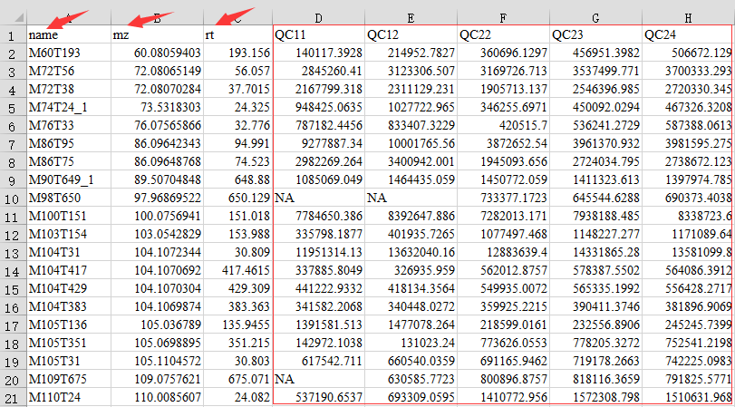 -->


## 准备样品信息

样品信息文件（.csv格式）用于描述样本进样顺序，样品类，批次和分组信息。第一列命名为“sample.name”，第二列命名为“injection.order”，第三列命名为“class”，第四列为“batch”，第五列为“group”。 样品信息文件应如下图所示：

<!-- 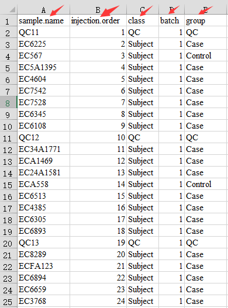 -->


<!-- --- -->

# 登录或者注册

## 注册

如果你是第一次使用 `MetFlow`，请首先注册账户。

1. 点击 "Sign up" ；
2. 输入个人信息；
3. 点击"Sign up" 按钮。

<!-- 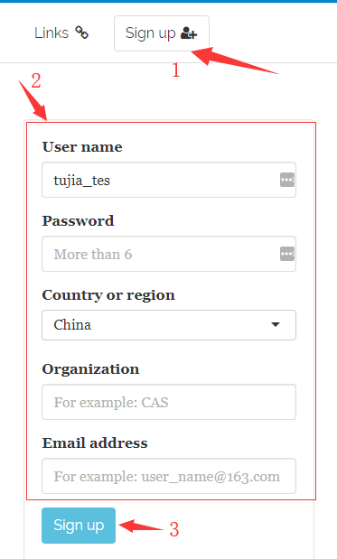 -->


## 登录

1. 点击"Log in & Account"；
2. 输入用户名和密码；
3. 点击"Log in"按钮。

<!-- 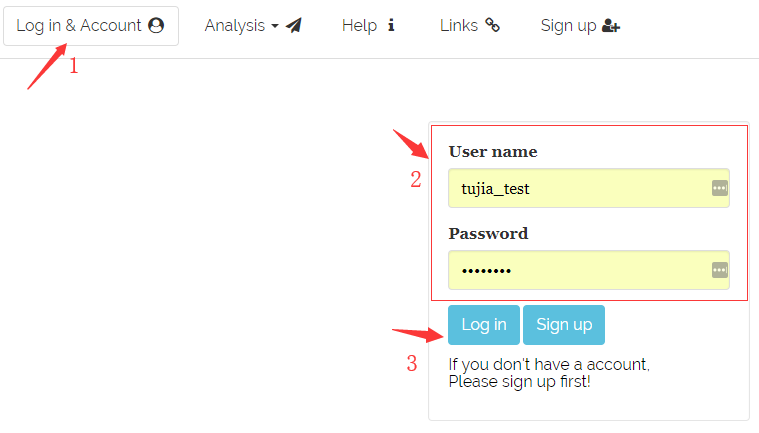 -->


<!-- --- -->

# 数据清洗

## 上传数据

1. 输入项目名称；
2. 选择MS1数据和样品信息；
3. 或者使用demo data；
4. 点击"Submit"按钮上传数据。

<!-- 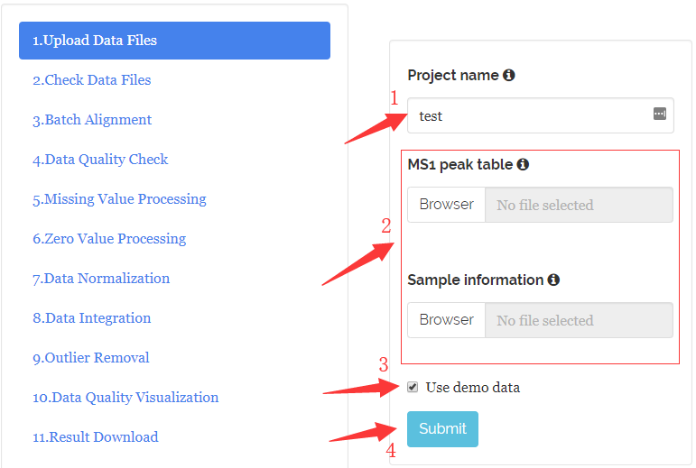 -->


## 检查数据格式

`MetFlow`会对上传的数据格式进行检查，如果有错误，请点击`Previous` 按钮检查你的数据格式，修改后并上传，如果没有错误，点击`Next`按钮。


## 批次对其

### 参数设置

1. 设置参数；
2. 点击`Submit`。

```{r setup, include=FALSE}
library(kableExtra)
library(magrittr)
knitr::opts_chunk$set(echo = TRUE)
```

```{r, echo=FALSE}
knitr::kable(
  data.frame("Paramter" = c("m/z tolerance (ppm)",
                            "Retention time tolerance (second)"),
  "Meaning" = c("m/z tolerance (ppm) for rough alignment.",
                "Retention time tolerance (ppm) for rough alignment."),
  stringsAsFactors = FALSE
  ),
  caption = 'Parameters of batch alignment',
   format = "latex", booktabs = TRUE) %>%
    kableExtra::kable_styling(full_width = TRUE
                # latex_options = "scale_down",
                # font_size = 20
                )
```

<!-- 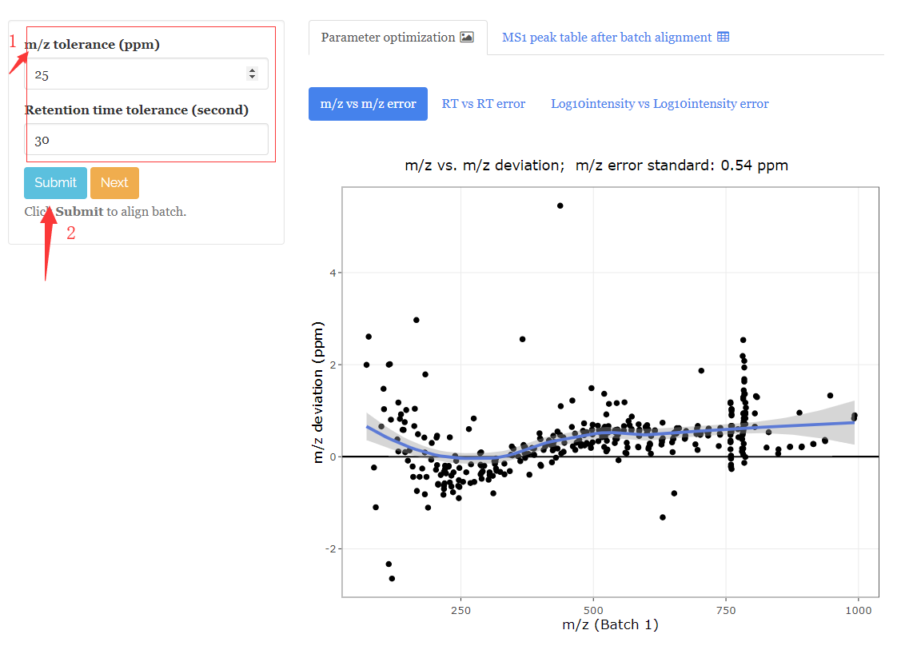 -->


### 结果

1. "Parameter optimization"展示了 m/z error, RT error and log10intensity error deviation in rough alignment； 
2. "MS1 peak table after batch alignment"展示了aligned MS1 peak table, 用户可以点击`Download`下载。

<!-- 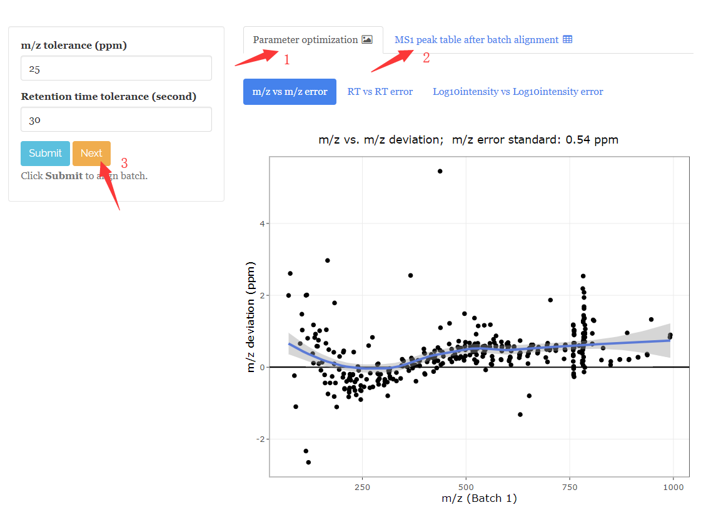 -->


## 数据质量检查

使用7个指标对数据质量进行检查:

1. 数据概览: m/z vs RT vs log10(intensity);
2. 缺失值分布;
3. 零值分布;
4. RSD分布;
5. PCA score plot;
6. QC intensity boxplot;
7. QC correlation;

<!-- 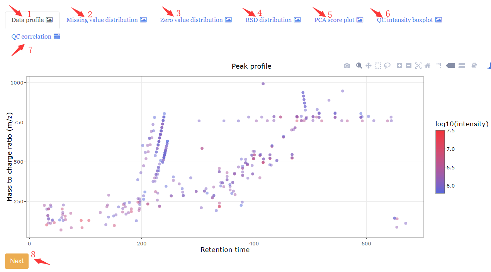 -->


## 缺失值处理

### 参数设置

1. 设置参数；
2. 点击`Submit`。

```{r, echo=FALSE}
knitr::kable(
  data.frame("Paramter" = c("Remove peaks with MV ratio > (%)", 
                            "Imputation method"),
  "Meaning" = c("It means that if the MV ratio larger than \nthe threshold you set, the peaks will                  be removed from the dataset. For example, the default of this parameter is 50,                    it means that for each peak, if its MV ratio > 50%, this peak will be removed.",
              "`MetFlow` has 9 methods for missing value imputation: 1) Zero value, 2) Mean,                     3) Median, 4) Minumun, 5) KNN, 6) missForest and 7) BPCA. The default is KNN."),
  stringsAsFactors = FALSE
  ),
  caption = 'Parameters of missing value processing',
  format = "latex", booktabs = TRUE) %>%
  kableExtra::kable_styling(full_width = TRUE
                # latex_options = "scale_down",
                # font_size = 20
                )
```


<!-- 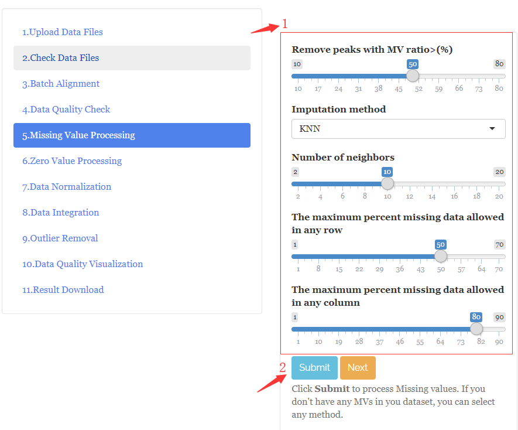 -->


### 结果

1. Summary: 展示被删除的峰；
2. MS1 peak table (after MV processing);


<!-- 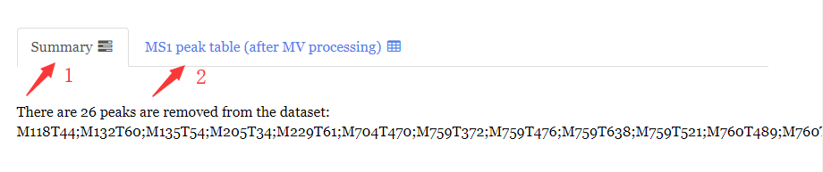 -->


## 零值处理

1. 设置参数；
2. 点击`Submit`按钮；
3. Summary: 展示被删除的峰；
4. MS1 peak table (after zero processing);
5. 点击`Next`按钮。


```{r, echo=FALSE}
knitr::kable(
  data.frame("Paramter" = c("Remove peaks with zero ratio > (%)"),
  "Meaning" = c("It means that if the zero ratio larger than the threshold you set, the peaks will be removed from the dataset. For example, the default of this parameter is 50, it means that for each peak, if its zero ratio > 50%, this peak will be removed."),
  stringsAsFactors = FALSE
  ),
  caption = 'Parameters of zero value processing',
   format = "latex", booktabs = TRUE)%>%
    kableExtra::kable_styling(full_width = TRUE
                # latex_options = "scale_down",
                # font_size = 20
                )
```

**NOTE:** If there are no missing values in your data, you can select any imputation method.

<!-- 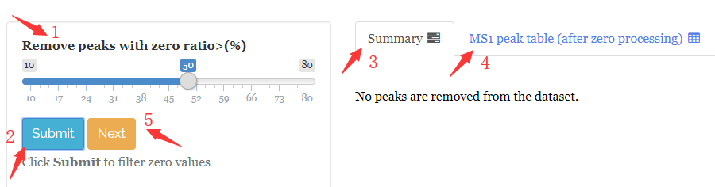 -->


## 数据标准化

### 参数设置

1. 设置参数；
2. 点击`Submit`按钮。

```{r, echo=FALSE}
knitr::kable(
  data.frame("Paramter" = c("QC sample-based methods", "Normalization method"),
  "Meaning" = c("You can check the methods based QC sample or not.",
                "There are 3 common used non-QC sample-based methods: 'Mean', 'Median' and 'Total'. And there are two common used QC sample-based methods: 'QC SVR (MetNormalizer)' and 'QC LOESS'. "),
  stringsAsFactors = FALSE
  ),
  caption = 'Parameters of data normalization',
   format = "latex", booktabs = TRUE)%>%
    kableExtra::kable_styling(full_width = TRUE
                # latex_options = "scale_down",
                # font_size = 20
                )
```


<!-- 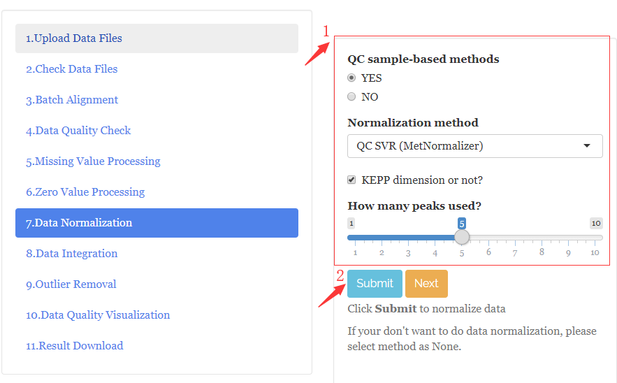 -->


### 结果

#### Summary

1. QC intensity box plot before normalization;
2. QC intensity box plot after normalization;
3. RSD comparison;
4. The distribution of RSDs of peaks.

<!-- 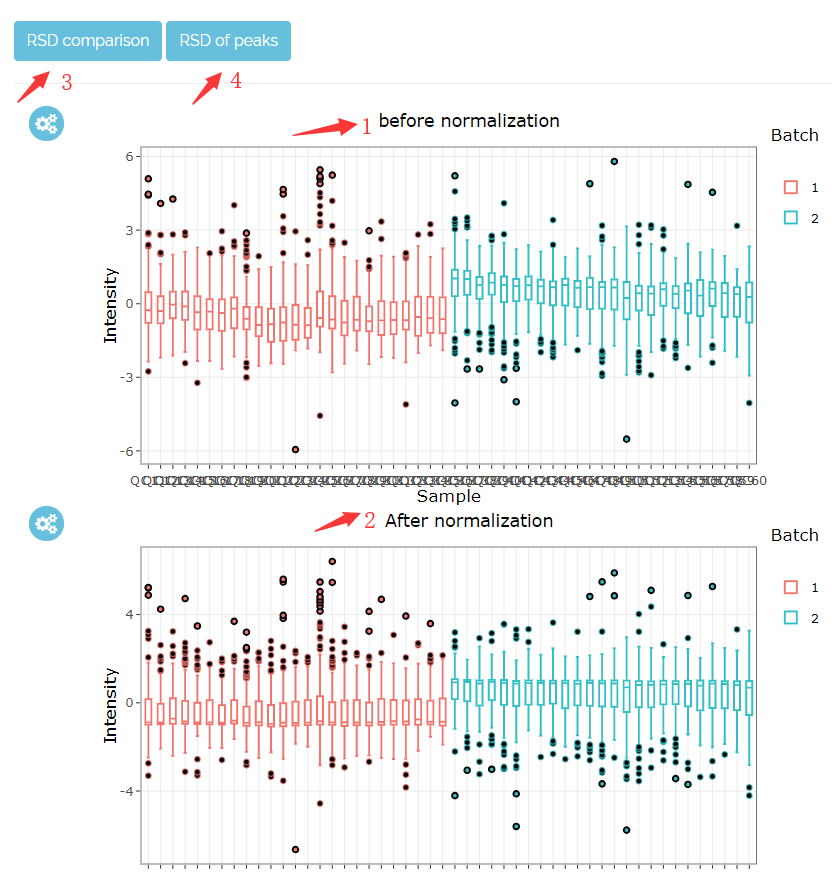 -->


#### MS1 peak table (after data normalization)


## 数据整合

### 参数设置

1. 设置参数；
2. 点击`Submit`按钮。

```{r, echo=FALSE}
knitr::kable(
  data.frame("Paramter" = c("QC sample-based methods", "Integration method"),
  "Meaning" = c("You can check the methods based QC sample or not.",
                "There are 2 common used non-QC sample-based methods: 'Subject mean' and 'Subject median'. And there are two common used QC sample-based methods: 'QC mean' and 'QC median'."),
  stringsAsFactors = FALSE
  ),
  caption = 'Parameters of data integration',
   format = "latex", booktabs = TRUE)%>%
    kableExtra::kable_styling(full_width = TRUE
                # latex_options = "scale_down",
                # font_size = 20
                )
```

 
<!-- 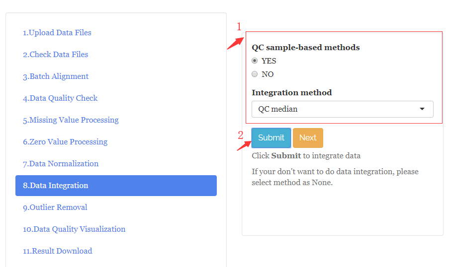 -->


## 离群点去除

### 参数设置

```{r, echo=FALSE}
knitr::kable(
  data.frame("Paramter" = c("Logarithm method", "Scale method", 
                            "Samples will be considered as outliers outside % CI",
                            "Samples will be considered as outliers with zero value ratio > %"),
  "Meaning" = c("default is 'Log 10'.", "default is 'Auto scale'.",
                "It means that if one sample is outside % confidence interval, the sample will be considered as outlier samples. The default is 95%.",
                "It means that it one sample with zero value ratio bigger than %, the sample will be considered as outliers. The default is 50%."),
  stringsAsFactors = FALSE
  ),
  caption = 'Parameters of outlier removal',
    format = "latex", booktabs = TRUE)%>%
    kableExtra::kable_styling(full_width = TRUE
                # latex_options = "scale_down",
                # font_size = 20
                )
```

<!-- 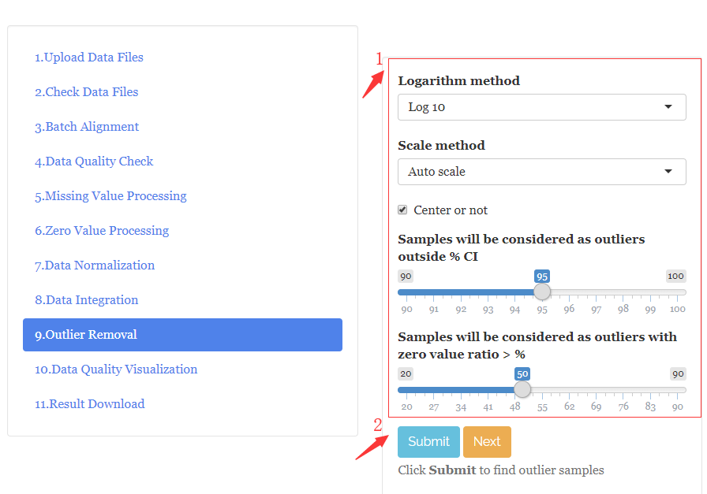 -->


### 删除离群值

1. 观察离群值信息；
2. 选择你想要删除的离群值；
3. 点击`Delete`按钮；
4. 点击`Submit` 按钮。

<!-- 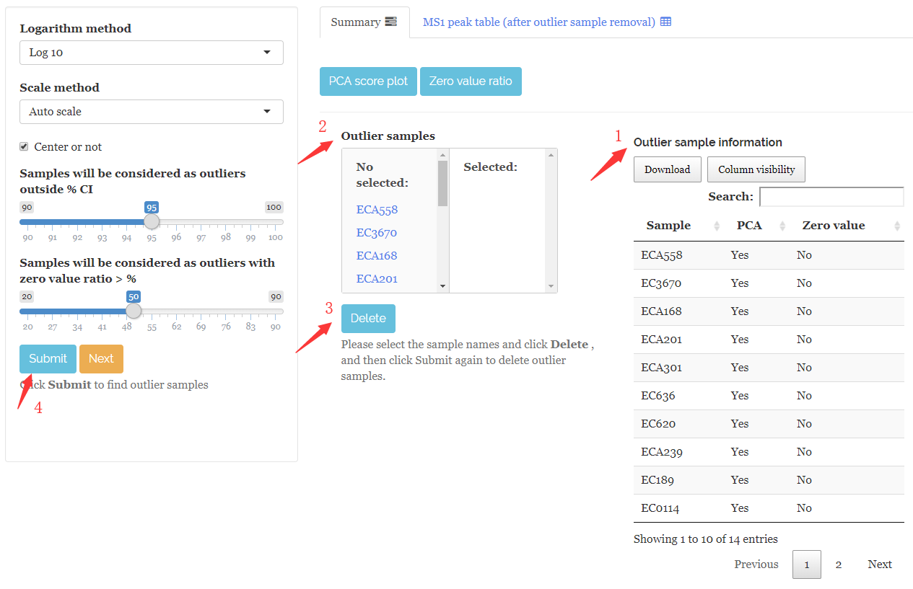 -->


## 数据质量的可视化

`MetFlow`在数据清洗之后，对数据质量重新进行检查。

## 结果下载

1. 点击`Generate HTML Summary`；
2. 点击`Download HTML Summary`；
3. 点击`Generate Analysis Result`；
4. 然后点击`Download Analysis Result`。

<!-- 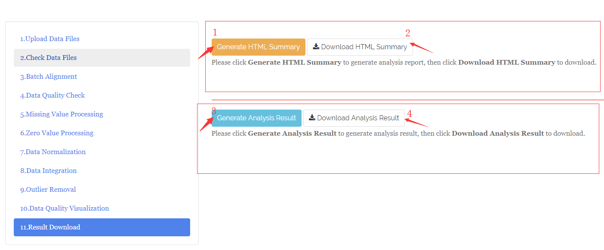 -->


